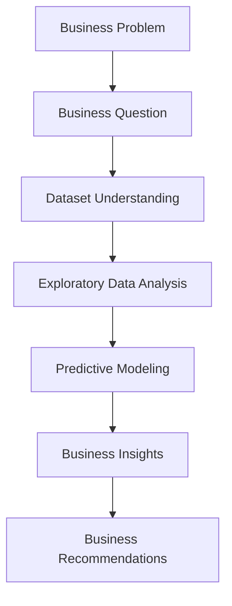

# Early Identification of At-Risk Students

*A Business Analytics Case Study for Educational Decision Support*

---

## Project Overview

Schools often identify struggling students only after final grades are released, leaving little opportunity for effective intervention.

This project explores whether students at academic risk can be identified before the end of the semester to support earlier and more effective educational decisions.

---

## Business Problem

Schools need to identify students who require additional academic support before final grades are released.

> **Business Question**
>
> Can students at risk be identified before the end of the semester so that schools can provide timely support?

The goal is to support earlier intervention and help school administrators allocate educational resources more effectively.

---

## Executive Summary

This project explored whether students at academic risk can be identified before the end of the semester using historical student data.

The analysis found that previous academic failures, study habits, and educational aspirations were the strongest indicators of academic risk. Among the evaluated models, Logistic Regression achieved the most balanced overall performance for early identification.

These findings suggest that schools can identify at-risk students earlier and provide more targeted academic support before final grades are released.

---

## Project Objectives

This project aims to:

- Identify students at academic risk before the end of the semester.
- Explore the key factors associated with student performance through exploratory data analysis.
- Develop predictive models for early risk identification.
- Translate analytical findings into actionable recommendations for school administrators.

---

## Dataset

### Dataset at a Glance

| Item | Value |
|------|-------|
| Dataset | Student Performance Dataset |
| Students | 649 |
| Variables | 33 |
| Missing Values | 0 |
| Prediction Task | Binary Classification |

The dataset includes student demographics, family background, academic history, study habits, lifestyle factors, and final academic performance (G3).

For this project, the target variable was redefined as:

> **At-risk Student = Final Grade (G3) ≤ 12**

This converts the original regression task into a binary classification problem, allowing earlier identification of students who may require additional academic support.

**Source**

- UCI Machine Learning Repository — Student Performance Dataset
- Kaggle Mirror: https://www.kaggle.com/datasets/uciml/student-alcohol-consumption

---

## Methodology

The overall workflow is illustrated below.



---

## Key Findings

### Previous Academic Failures

Students with previous academic failures were consistently more likely to become at-risk students.

This factor showed the strongest relationship with academic risk across both exploratory analysis and predictive modeling.

---

### Study Habits & Educational Aspirations

Students who studied more and planned to pursue higher education generally achieved better academic outcomes.

These factors suggest that both learning behavior and motivation play an important role in academic performance.

---

### Best Predictive Model

**Logistic Regression**

| Metric | Score |
|--------|------:|
| Accuracy | 66.9% |
| Recall | 68.5% |
| F1-score | 69.9% |

Logistic Regression achieved the most balanced performance among the evaluated models for early identification of at-risk students.

---

### Business Impact

The analysis shows that students at academic risk can be identified before final grades are released.

Earlier identification allows schools to prioritize support and intervene before academic performance declines further.

---

## Business Recommendations

Based on the findings, the following actions are recommended:

- Identify at-risk students as early as possible using predictive models.
- Prioritize students with previous academic failures for early intervention.
- Collaborate with teachers and parents to better understand individual learning needs.
- Provide targeted support, such as tutoring, counseling, or personalized learning plans.

---

## Repository Structure

```text
early-identification-at-risk-students/
│
├── README.md
├── early_identification_at_risk_students.ipynb
└── student-por.csv
```

| File | Description |
|------|-------------|
| `README.md` | Project overview, methodology, key findings, and business recommendations. |
| `early_identification_at_risk_students.ipynb` | Complete Business Analytics workflow, including EDA, predictive modeling, model evaluation, and business insights. |
| `student-por.csv` | Original dataset used for analysis. |

---

## Future Improvements

Future work could further improve the project by:

- Incorporating additional data, such as attendance records or learning engagement.
- Validating the models using data from different schools or academic years.
- Developing an interactive dashboard for monitoring at-risk students.
- Evaluating whether early interventions improve student outcomes over time.

---

## Skills Applied

- Python (Pandas, Scikit-learn)
- Exploratory Data Analysis (EDA)
- Predictive Modeling
- Data Visualization
- Business Analytics
- Business Storytelling
- Machine Learning
