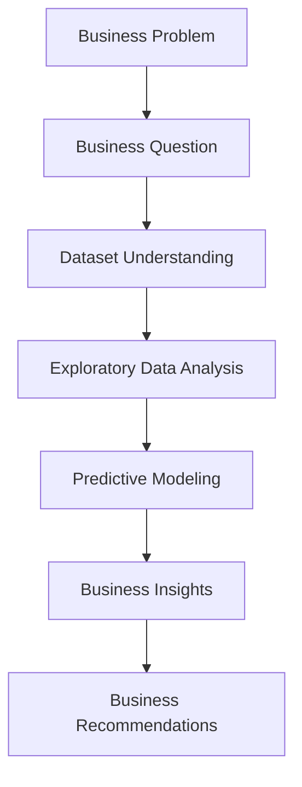

# Early Identification of At-Risk Students

*A Business Analytics Case Study for Educational Decision Support*

---

## Project Overview

This project analyzes student academic performance using data analytics and machine learning to identify students at risk before the end of the semester.

Starting from a real business problem in the education domain, the project combines exploratory data analysis (EDA), predictive modeling, and business insights to support early intervention and resource allocation.

Rather than focusing only on model accuracy, the project emphasizes how data can support practical decision-making for school administrators.

---

## Business Problem

Schools often identify struggling students only after the final exam, leaving little opportunity for timely intervention.

This project aims to answer an important business question:

> Can we identify students who are at risk before the end of the semester so that schools can provide timely support?

The goal is not simply to build a predictive model, but to help decision-makers allocate educational resources more effectively.

---

## Executive Summary

---

## Project Objectives

The objectives of this project are to:

- Identify students who are at risk of poor academic performance before the end of the semester.
- Explore the factors associated with student performance through exploratory data analysis.
- Develop predictive models to support early identification of at-risk students.
- Translate analytical findings into actionable business recommendations for school administrators.

---

## Dataset

---

## Methodology

The project follows a structured Business Analytics workflow, moving from problem definition to actionable business recommendations through data-driven analysis.

---

## Key Findings

---

## Business Recommendations

---

## Repository Structure

---

## Future Improvements
