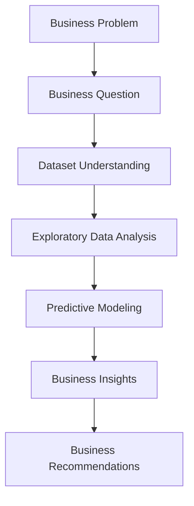

# Early Identification of At-Risk Students

*A Business Analytics Case Study for Educational Decision Support*

---

## Project Overview

Early identification of students at academic risk allows schools to provide timely support before poor performance becomes irreversible.

This case study applies business analytics and machine learning to predict at-risk students before the end of the semester. Through exploratory data analysis, predictive modeling, and business interpretation, the project demonstrates how data can support educational decision-making and improve resource allocation.

Rather than pursuing the highest possible model accuracy, the focus is on generating insights that school administrators can use in practice.

---

## Business Problem

Schools often identify struggling students only after final grades are released, leaving little opportunity for effective intervention.

This project addresses the following business question:

> **Can students at risk be identified before the end of the semester so that schools can provide timely support?**

Instead of building a model for prediction alone, the goal is to help decision-makers allocate educational resources earlier and more effectively.

---

## Executive Summary

Schools often identify struggling students only after final grades are released, leaving little time for effective intervention. This project explores whether students at academic risk can be identified earlier using historical student data.

The analysis combines exploratory data analysis with predictive modeling to identify students who may need additional support before the end of the semester. The results indicate that previous academic failures, study habits, and educational aspirations are closely associated with academic risk.

Rather than focusing only on model performance, this project emphasizes how analytical findings can support practical decisions. By identifying at-risk students earlier, schools can prioritize resources and provide timely interventions.

---

## Project Objectives

The objectives of this project are to:

- Identify students who are at risk of poor academic performance before the end of the semester.
- Explore the factors associated with student performance through exploratory data analysis.
- Develop predictive models to support early identification of at-risk students.
- Translate analytical findings into actionable business recommendations for school administrators.

---

## Dataset

The analysis is based on the **Student Performance Dataset**, originally published by the **UCI Machine Learning Repository (UCI ML Repository)** and accessed through the **Kaggle UCI ML Repository mirror**.

The dataset includes **649 Portuguese secondary school students** and **33 variables** covering:

- Student demographics
- Family background
- Academic history
- Study habits
- Lifestyle factors
- Final academic performance (G3)

To better support educational decision-making, the original prediction target was redefined as:

> **At-risk Student = Final Grade (G3) ≤ 12**

This transforms the original regression problem into a binary classification task, allowing schools to identify students who may need academic support before the semester ends.

The dataset contains no missing values and includes a broad range of academic, demographic, and behavioral variables, making it well suited for educational analytics and predictive modeling.

**Source**

- UCI Machine Learning Repository — Student Performance Dataset
- Kaggle Mirror: https://www.kaggle.com/datasets/uciml/student-alcohol-consumption

---

## Methodology

The analysis follows a Business Analytics workflow, starting from problem identification and ending with actionable recommendations for decision-makers.



---

## Key Findings

### 1. Previous academic failures were the strongest indicator of at-risk students.

Students with a history of academic failures consistently showed a significantly higher risk of poor final academic performance across exploratory analysis and predictive modeling.

---

### 2. Study habits and educational aspirations were positively associated with student performance.

Students who spent more time studying and planned to pursue higher education generally achieved better final grades, suggesting that both academic behavior and learning motivation contribute to academic success.

---

### 3. Logistic Regression delivered the best overall performance for identifying at-risk students.

Among the evaluated models, Logistic Regression achieved the most balanced performance:

- Accuracy: **66.9%**
- Recall: **68.5%**
- F1-score: **69.9%**

These results make it the most appropriate model for early identification within the scope of this project.

---

### 4. Student risk can be identified before the end of the semester, enabling earlier educational intervention.

Combining demographic, family, and academic information allows schools to recognize students who may require additional support before final grades are released, making proactive intervention and resource allocation possible.

---

## Business Recommendations

Based on the analytical findings, schools should:

- Identify at-risk students as early as possible using predictive models.
- Prioritize students with previous academic failures for early intervention.
- Work with teachers and parents to better understand individual learning challenges.
- Provide targeted support, such as tutoring, counseling, or personalized learning plans, before academic performance declines further.

---

## Repository Structure

```text
early-identification-at-risk-students/
│
├── README.md
├── early_identification_at_risk_students.ipynb
└── student-por.csv
```

| File | Description |
|------|-------------|
| `README.md` | Project overview, methodology, key findings, and business recommendations. |
| `early_identification_at_risk_students.ipynb` | Complete Business Analytics workflow, including EDA, predictive modeling, model evaluation, and business insights. |
| `student-por.csv` | Original dataset used for analysis. |

---

## Future Improvements
