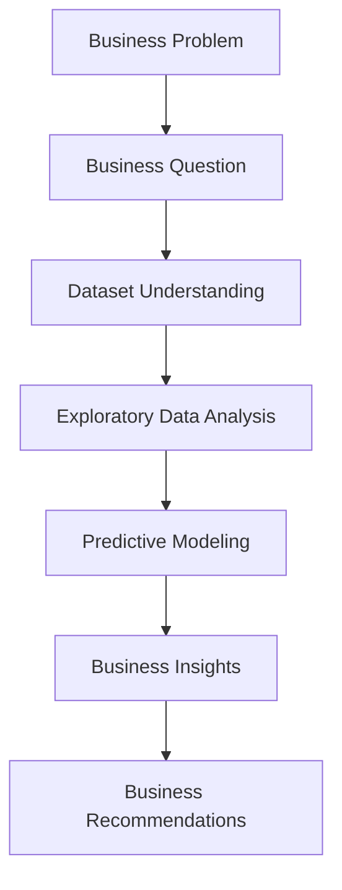

# Early Identification of At-Risk Students

*A Business Analytics Case Study for Educational Decision Support*

---

## Project Overview

Schools often identify struggling students only after final grades are released, leaving little time for effective intervention.

This study examines whether at-risk students can be identified before the end of the semester, giving schools more time to provide support.

---

## Business Problem

Schools need a way to identify students who may need additional support before final grades are released.

> **Business Question**
>
> Can students at risk be identified before the end of the semester so that schools can provide timely support?

Early identification allows schools to intervene sooner and better prioritize support.

---

## Executive Summary

Historical student data was used to examine whether at-risk students could be identified before the end of the semester.

Previous academic failures, study habits, and educational aspirations emerged as the strongest indicators of academic risk. Logistic Regression delivered the most balanced performance among the evaluated models.

The results show that schools can identify at-risk students earlier and provide more targeted support before final grades are released.

---

## Project Objectives

The project aims to:

- Identify students at academic risk before the end of the semester.
- Explore the key factors associated with student performance through exploratory data analysis.
- Develop predictive models to identify at-risk students earlier.
- Translate analytical findings into actionable recommendations for school administrators.

---

## Dataset

### Dataset at a Glance

| Item | Value |
|------|-------|
| Dataset | Student Performance Dataset |
| Students | 649 |
| Variables | 33 |
| Missing Values | 0 |
| Prediction Task | Binary Classification |

The dataset includes student demographics, family background, academic history, study habits, lifestyle factors, and final academic performance (G3).

For this project, the target variable was redefined as:

> **At-risk Student = Final Grade (G3) ≤ 12**

The new target converts the original regression task into a binary classification problem, allowing earlier identification of students who may require additional academic support.

**Source**

- UCI Machine Learning Repository — Student Performance Dataset
- Kaggle Mirror: https://www.kaggle.com/datasets/uciml/student-alcohol-consumption

---

## Methodology

The workflow is shown below.



---

## Key Findings

### Previous Academic Failures

Students with previous academic failures were consistently more likely to be at risk.

This was the strongest predictor across both exploratory analysis and predictive modeling.

---

### Study Habits & Educational Aspirations

Students who studied more and planned to pursue higher education generally performed better.

The results suggest that both study habits and motivation contribute to academic success.

---

### Best Predictive Model

**Logistic Regression**

| Metric | Score |
|--------|------:|
| Accuracy | 66.9% |
| Recall | 68.5% |
| F1-score | 69.9% |

Logistic Regression delivered the most balanced performance among the evaluated models.

---

### Business Impact

Students at academic risk can be identified before final grades are released.

Earlier identification gives schools more time to provide targeted support.

---

## Business Recommendations

Recommended actions:

- Identify at-risk students as early as possible using predictive models.
- Prioritize students with previous academic failures for early intervention.
- Work with teachers and parents to better understand each student's needs.
- Provide targeted support, such as tutoring, counseling, or personalized learning plans.

---

## Repository Structure

```text
early-identification-at-risk-students/
│
├── README.md
├── early_identification_at_risk_students.ipynb
└── student-por.csv
```

| File | Description |
|------|-------------|
| `README.md` | Project overview, methodology, key findings, and business recommendations. |
| `early_identification_at_risk_students.ipynb` | Complete Business Analytics workflow, including EDA, predictive modeling, model evaluation, and business insights. |
| `student-por.csv` | Original dataset used for analysis. |

---

## Future Improvements

Possible next steps:

- Incorporating additional data, such as attendance records or learning engagement.
- Validating the models using data from different schools or academic years.
- Developing an interactive dashboard for monitoring at-risk students.
- Evaluating whether early interventions improve student outcomes over time.

---

## Skills & Tools

- Python (Pandas, Scikit-learn)
- Exploratory Data Analysis (EDA)
- Predictive Modeling
- Data Visualization
- Business Analytics
- Business Storytelling
- Machine Learning
