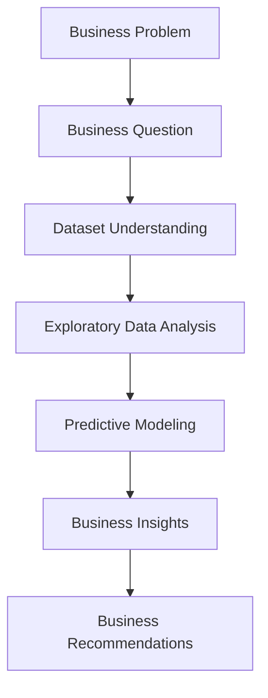

# Early Identification of At-Risk Students

*A Business Analytics Case Study for Educational Decision Support*

---

## Project Overview

This project analyzes student academic performance using data analytics and machine learning to identify students at risk before the end of the semester.

Starting from a real business problem in the education domain, the project combines exploratory data analysis (EDA), predictive modeling, and business insights to support early intervention and resource allocation.

Rather than focusing only on model accuracy, the project emphasizes how data can support practical decision-making for school administrators.

---

## Business Problem

Schools often identify struggling students only after the final exam, leaving little opportunity for timely intervention.

This project aims to answer an important business question:

> Can we identify students who are at risk before the end of the semester so that schools can provide timely support?

The goal is not simply to build a predictive model, but to help decision-makers allocate educational resources more effectively.

---

## Executive Summary

---

## Project Objectives

The objectives of this project are to:

- Identify students who are at risk of poor academic performance before the end of the semester.
- Explore the factors associated with student performance through exploratory data analysis.
- Develop predictive models to support early identification of at-risk students.
- Translate analytical findings into actionable business recommendations for school administrators.

---

## Dataset

This project uses the **Student Performance Dataset**, originally published by the **UCI Machine Learning Repository (UCI ML Repository)** and accessed through the **Kaggle UCI ML Repository mirror**.

The dataset contains **649 Portuguese secondary school students** and **33 variables**, covering:

- Student demographics
- Family background
- Academic history
- Study habits
- Lifestyle factors
- Final academic performance (G3)

To support early intervention from a business perspective, this project redefines the prediction target as:

> **At-risk Student = Final Grade (G3) ≤ 12**

This transformation converts the original regression problem into a binary classification task, allowing schools to identify students who may require additional academic support before the end of the semester.

The dataset contains no missing values and provides rich academic, demographic, and behavioral information, making it well suited for educational analytics and predictive modeling.

**Source**

- UCI Machine Learning Repository — Student Performance Dataset
- Kaggle Mirror: https://www.kaggle.com/datasets/uciml/student-alcohol-consumption

---

## Methodology

The project follows a structured Business Analytics workflow, moving from problem definition to actionable business recommendations through data-driven analysis.

---

## Key Findings

### 1. Previous academic failures were the strongest indicator of at-risk students.

Students with a history of academic failures consistently showed a significantly higher risk of poor final academic performance across exploratory analysis and predictive modeling.

---

### 2. Study habits and educational aspirations were positively associated with student performance.

Students who spent more time studying and planned to pursue higher education generally achieved better final grades, suggesting that both academic behavior and motivation play important roles in learning outcomes.

---

### 3. Logistic Regression achieved the best overall performance for identifying at-risk students.

Among the evaluated models, Logistic Regression provided the most balanced performance, achieving:

- Accuracy: **66.9%**
- Recall: **68.5%**
- F1-score: **69.9%**

making it the most suitable model for early identification of at-risk students in this project.

---

### 4. Student risk can be identified before the end of the semester, enabling earlier educational intervention.

By combining student demographic, family, and academic information, schools can identify students who may require additional support before final grades are released, allowing educational resources to be allocated more proactively.

---

## Business Recommendations

Based on the analytical findings, schools should:

- Identify at-risk students as early as possible using predictive models.
- Prioritize students with previous academic failures for early intervention.
- Work with teachers and parents to understand individual learning challenges.
- Provide targeted support, such as tutoring, counseling, or personalized learning plans, before academic performance declines further.

---

## Repository Structure

---

## Future Improvements
